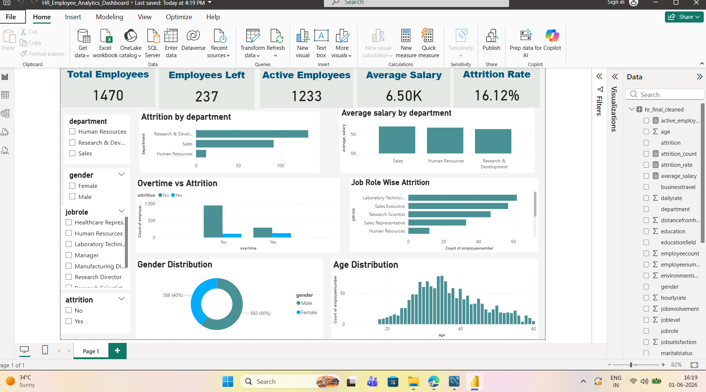

# HR Employee Analytics Dashboard

## Project Overview

This project analyzes HR employee data to identify attrition patterns, workforce demographics, salary trends, overtime impact, and other HR-related insights.

The project follows an end-to-end data analytics workflow:

**Raw Dataset → Python Data Cleaning & EDA → SQL Analysis → Power BI Dashboard → Business Insights**

It demonstrates practical skills in Python, Pandas, SQL, MySQL, Power BI, data cleaning, exploratory data analysis, and business reporting.

---

## Business Problem

Employee attrition can increase hiring costs, affect productivity, create knowledge gaps, and impact workforce planning.

This project helps HR teams understand employee trends and answer questions such as:

* Which departments have the highest employee attrition?
* Is overtime associated with higher attrition?
* Which job roles show higher attrition?
* How does salary vary across departments?
* What does the workforce distribution look like by age, gender, department, and role?
* Which employee groups may require further HR attention?

---

## Project Objectives

* Clean and prepare HR employee data for analysis.
* Analyze employee attrition and workforce demographics.
* Study salary patterns across departments and job roles.
* Examine overtime and work-life balance patterns related to attrition.
* Perform HR-focused analysis using SQL.
* Build an interactive Power BI dashboard for HR reporting.
* Generate actionable business insights and recommendations.

---

## Dataset Information

* **Dataset:** IBM HR Employee Attrition Dataset
* **Source:** Kaggle
* **Records:** 1,471 employee records
* **Columns:** 35 variables

The dataset includes employee-related information such as:

* Age
* Gender
* Department
* Job Role
* Monthly Income
* Attrition
* Overtime
* Work-Life Balance
* Years at Company
* Performance Rating
* Job Satisfaction
* Education Field
* Marital Status

> Note: This project is created for learning and portfolio purposes. The dataset does not represent actual employee information from a real organization.

---

## Tools and Technologies

* Python
* Pandas
* Matplotlib
* SQL
* MySQL
* Power BI
* GitHub

---

## Project Workflow

### 1. Data Cleaning and Exploratory Analysis Using Python

Python and Pandas were used to load, clean, prepare, and analyze the HR dataset.

Key tasks performed:

* Loaded the HR employee dataset using Pandas.
* Removed duplicate records.
* Standardized column names by converting them to lowercase.
* Replaced spaces in column names with underscores.
* Checked dataset size and missing values.
* Calculated key HR metrics such as total employees, attrition count, attrition rate, average salary, and department-wise employee count.
* Created exploratory visualizations for:

  * Department-wise employee count
  * Attrition by department
  * Salary distribution
  * Overtime vs attrition
  * Age distribution
  * Gender distribution
  * Average salary by department
  * Job role-wise attrition
  * Work-life balance vs attrition
* Exported cleaned datasets for SQL analysis and Power BI reporting.

---

### 2. SQL Analysis

SQL was used to answer HR-focused business questions and create reusable analytical views.

#### Basic SQL Analysis

The basic analysis includes:

* Total employee count
* Attrition count and attrition rate
* Department-wise employee count
* Department-wise attrition analysis
* Average salary by department
* Overtime vs attrition analysis
* Job role-wise attrition analysis
* Gender-wise workforce and attrition analysis
* Work-life balance vs attrition analysis
* Age group-wise attrition analysis

#### Advanced SQL Analysis

The advanced analysis includes:

* Department-wise salary ranking using:

  * `RANK()`
  * `DENSE_RANK()`
  * `ROW_NUMBER()`
* Employees earning above their department average using subqueries.
* Department attrition analysis using Common Table Expressions (CTEs).
* Salary-category-wise attrition analysis using `CASE` statements.
* Reusable SQL views for:

  * Employees who left the company
  * High-salary employees
  * Department salary and attrition summaries

---

### 3. Power BI Dashboard

An interactive Power BI dashboard was created to present workforce and attrition insights in a business-friendly format.

#### Dashboard KPIs

* Total Employees
* Employees Left
* Active Employees
* Average Salary
* Attrition Rate

#### Dashboard Visuals

* Attrition by Department
* Average Salary by Department
* Overtime vs Attrition
* Job Role-wise Attrition
* Gender Distribution
* Age Distribution

#### Dashboard Filters

* Department
* Gender
* Job Role
* Attrition

---

## Key Insights

* The overall attrition rate is approximately **16%**.
* The Research & Development department has the highest number of employee attrition cases in the dataset.
* Employees working overtime show higher attrition compared to employees who do not work overtime.
* Salary distribution differs across departments and job roles.
* Workforce distribution is concentrated in selected departments and job roles.
* Employee age, job role, overtime, and work-life balance can be explored as potential factors related to attrition.

> These findings indicate areas where HR teams may further investigate workload, employee engagement, compensation, career progression, and retention policies.

---

## Business Recommendations

Based on the analysis, possible HR actions include:

* Review overtime workloads in employee groups with higher attrition.
* Conduct employee-feedback surveys and exit-interview analysis in departments with higher attrition.
* Review salary and career-growth opportunities across departments and job roles.
* Monitor attrition trends regularly using HR dashboards.
* Use additional employee feedback and organizational data before making final HR decisions.

---

## Project Structure

```text
hr-employee-analytics-dashboard/
│
├── data/
│   ├── WA_Fn-UseC_-HR-Employee-Attrition.csv
│   ├── hr_cleaned.csv
│   └── hr_final_cleaned.csv
│
├── python/
│   └── data_cleaning.py
│
├── sql/
│   ├── basic_hr_analysis.sql
│   └── advanced_hr_analysis.sql
│
├── powerbi/
│   └── HR_Employee_Analytics_Dashboard.pbix
│
├── screenshots/
│   └── hr_dashboard_main.png
│
└── README.md
```

---

## Dashboard Preview



---

## How to Run the Project

### Python Analysis

1. Clone or download this repository.
2. Install the required libraries:

```bash
pip install pandas matplotlib
```

3. Open the `python` folder.
4. Run the data-cleaning and analysis script:

```bash
python data_cleaning.py
```

5. Review the cleaned datasets saved in the `data` folder.

### SQL Analysis

1. Create a database in MySQL.
2. Import the cleaned HR dataset into an `employees` table.
3. Run the queries available in:

   * `sql/basic_hr_analysis.sql`
   * `sql/advanced_hr_analysis.sql`

### Power BI Dashboard

1. Open the `.pbix` file from the `powerbi` folder using Power BI Desktop.
2. Refresh the data source if required.
3. Use dashboard filters to explore attrition, salary, department, job role, gender, and workforce patterns.

---

## Skills Demonstrated

* Data Cleaning and Preprocessing
* Python Data Analysis with Pandas
* Exploratory Data Analysis
* HR Analytics
* Data Visualization with Matplotlib
* SQL Aggregations and Conditional Analysis
* SQL Window Functions
* SQL Views, CTEs, and Subqueries
* Power BI Dashboard Development
* Business Insight Generation
* Data-Driven Decision Support

---

## Author

**Akhilesh Joshi**
MBA — Artificial Intelligence & Data Science

[LinkedIn](https://www.linkedin.com/in/akhilesh-joshi-a849283ab/)
[GitHub](https://github.com/AkhileshJoshi10)
